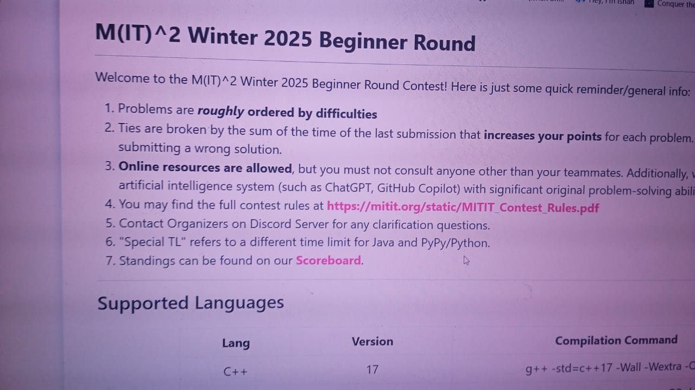
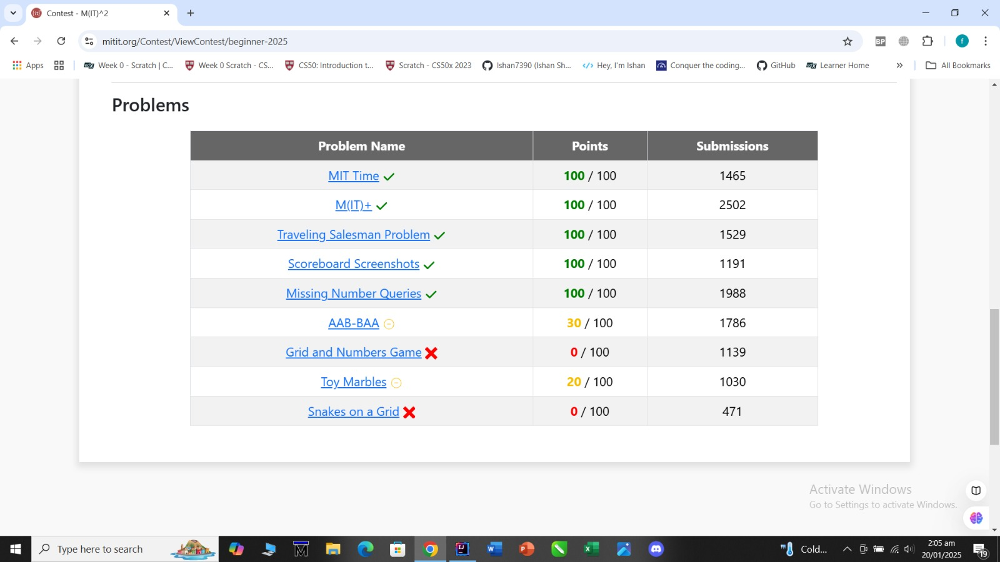
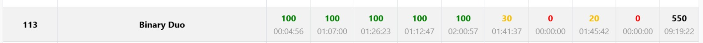
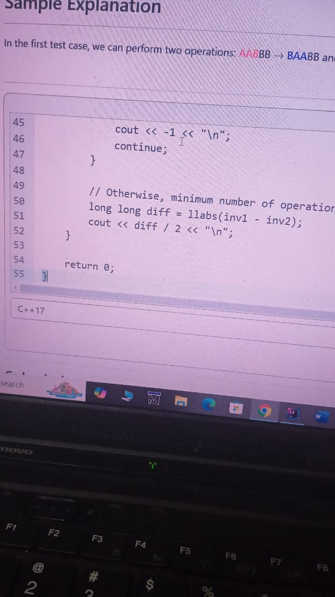

# M-IT-2 Coding Competition 2024

This repository showcases my solutions to the problems I encountered during the M-IT-2 Coding Competition 2024. The competition was an exhilarating journey filled with innovation, teamwork, and challenging problems that pushed the boundaries of creative thinking. Participating in this event was an incredible learning experience where I honed my problem-solving skills and collaborated with an amazing team.

To verify and learn more about my participation, you can check out my LinkedIn post below:  
[LinkedIn Post](https://www.linkedin.com/posts/danishmustafa86_mit-programming-leetcode-activity-7287015701360357376-a6Eh?utm_source=share&utm_medium=member_desktop)

## Team Members:

<table>
    <tbody>
        <tr>
            <td align="center">
                <a href="https://github.com/danishmustafa86">
                    
                     
                    <b>Danish Mustafa</b>
                </a> 
            </td>
            <td align="center">
                <a href="https://github.com/abdullahsajid0">
                    
                     
                    <b>Abdullah Sajid</b>
                </a> 
            </td>
            <td align="center">
                <a href="https://github.com/faree777">
                    
                     
                    <b>Fareeha Amir</b>
                </a> 
            </td>
        </tr> 
    </tbody>
</table>

---

---

## My Problem Table:

## My Ranking:

## Some Insights During Contests:

| Problem | Solve | Statement |
| ------- | ----- | --------- |
|  |  |  |
