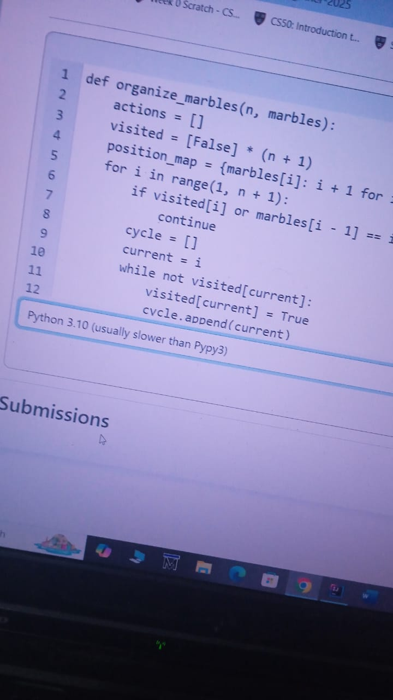

# M-IT-2-Coding-Competition-2024

This repository contains my solutions to the problems I tackled during the M-IT-2-Coding-Competition-2024. The competition was a thrilling experience filled with innovative and challenging problems. Below, you'll find a summary of the problems and the code implementations.

## Team Members:

<hr/>
<table>
    <tbody>
        <tr>
            <td align="center">
                <a href="https://github.com/danishmustafa86">
                    
                    <br />
                    <sub><b>Hassan Mehmood</b></sub>
                </a> 
            </td>
          <td align="center">
                <a href="https://github.com/abdullahsajid">
                    
                    <br />
                    <sub><b>Abudllah Sajid</b></sub>
                </a> 
            </td>
            <td align="center">
                <a href="https://github.com/fareehaamir">
                    
                    <br />
                    <sub><b>Fareeha Amir</b></sub>
                </a> 
            </td>
        </tr> 
</tbody>
<table>

---


## Repository Structure  

```plaintext
.
├── MIT Coding Contest/
│   ├── Advance Round 1                        # Solution to the CALICOnstruction problem
│   └── Advance Round 2 + Begineer Round       # For understanding the problem
├── Images/
|   ├── Problems.png         # All problems
│   ├── Ranking.png          # Solution to the Coding 90s in Loot List problem
│   └── Active.png           # For understanding the problem
└── README.md                # This file

```
---

## My Problem Table:


## My Ranking:


## Some Insights During Contests:

| Problem | Solve | Statement |
| ------- | ----- | --------- |
|  |  |  |